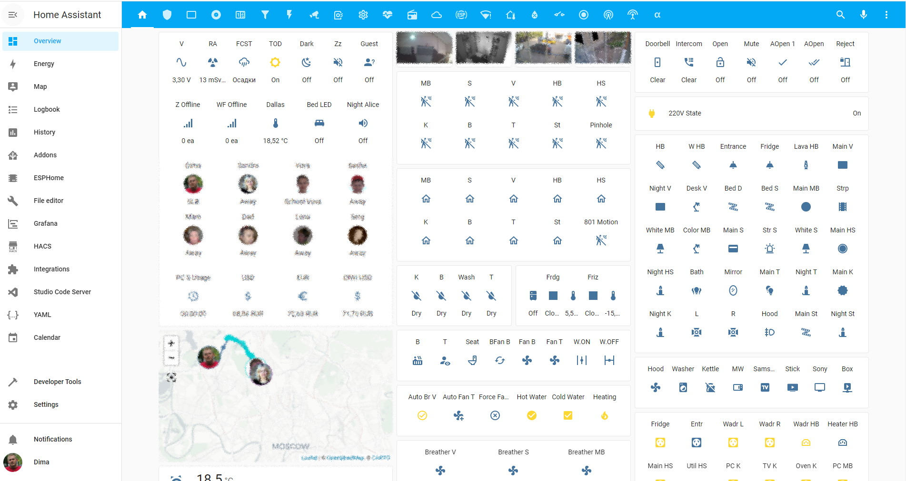
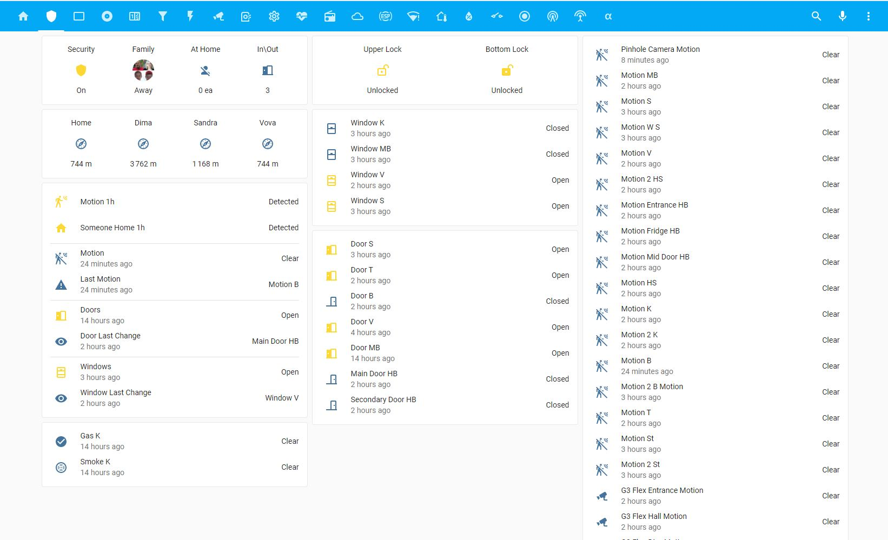
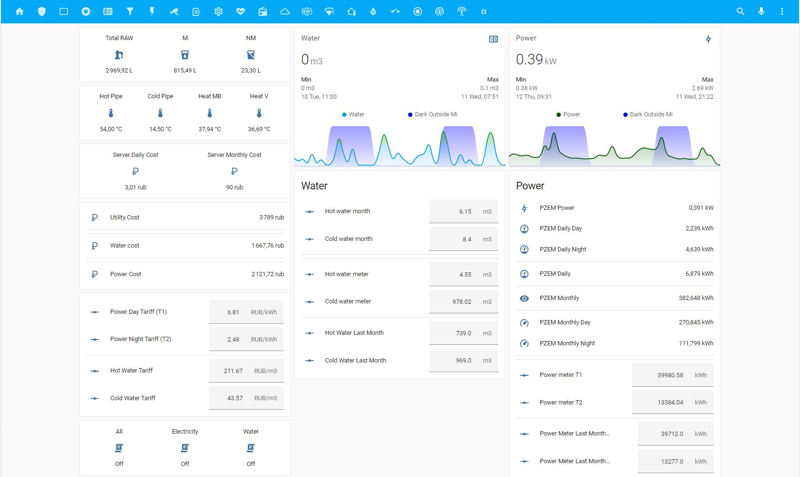
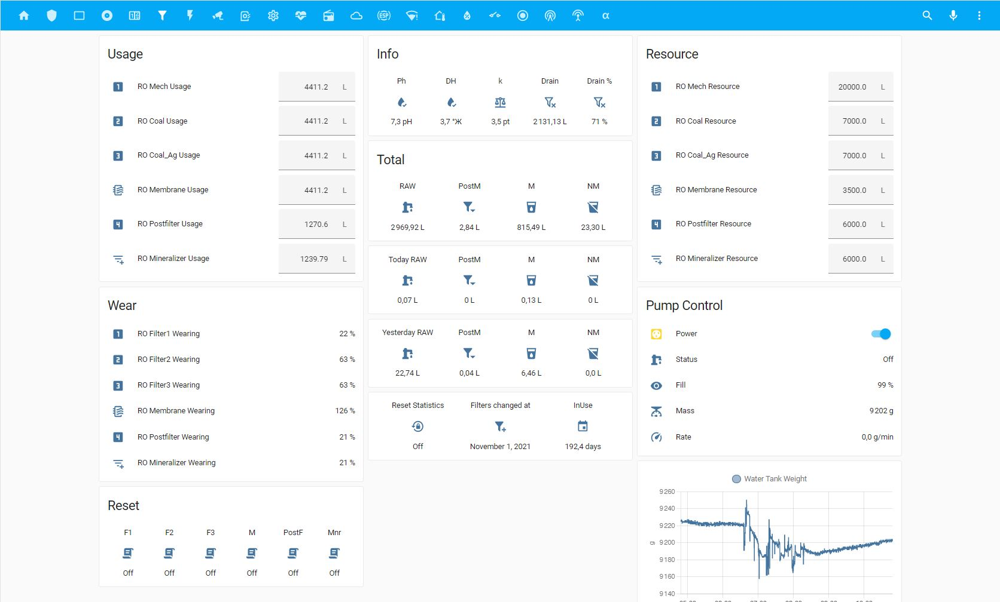
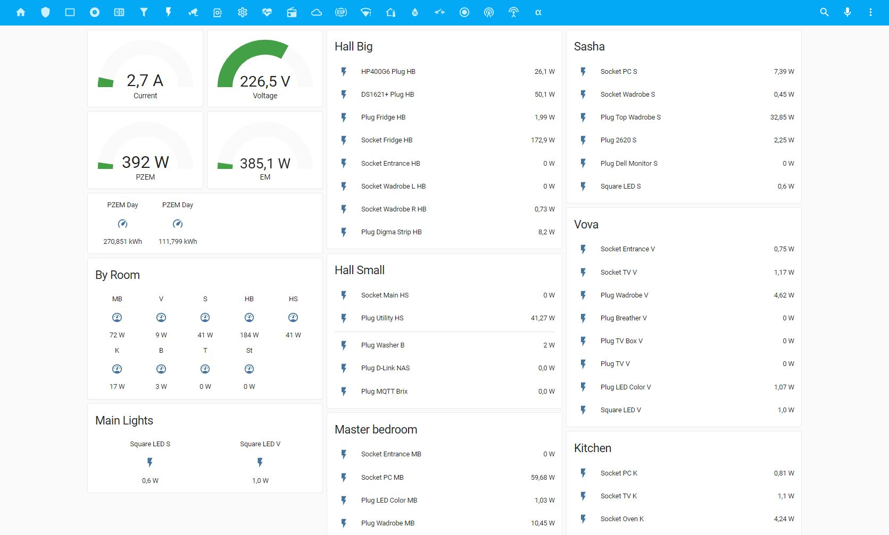
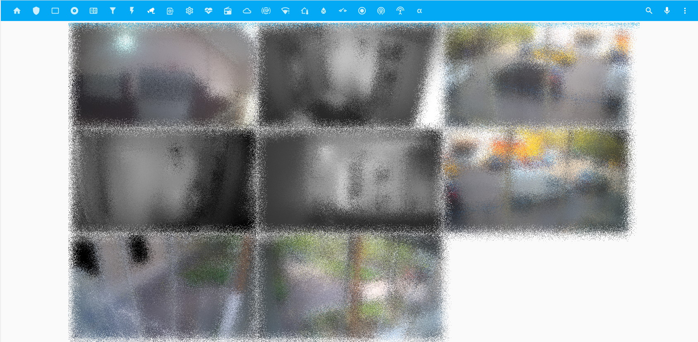
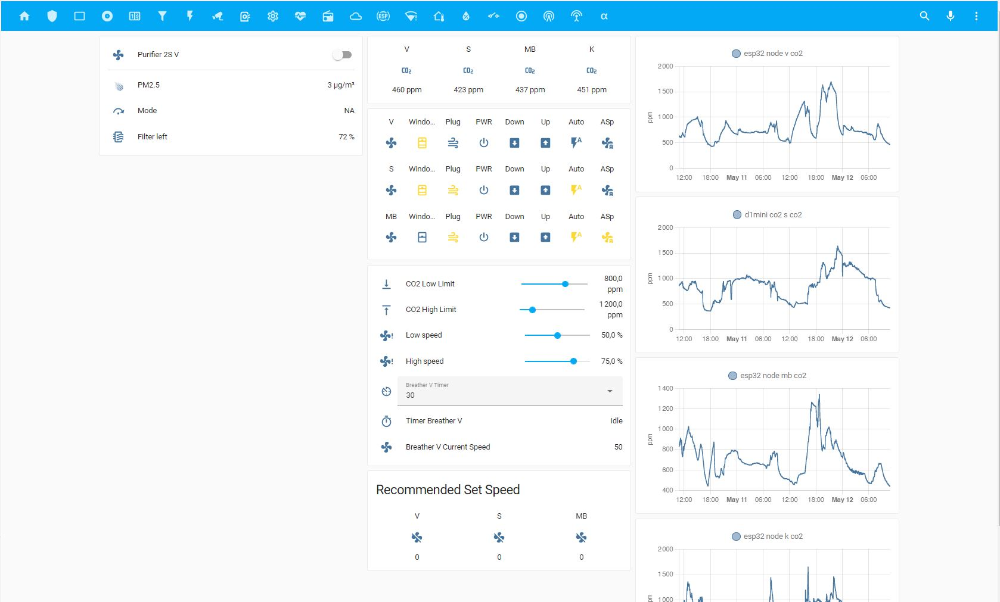
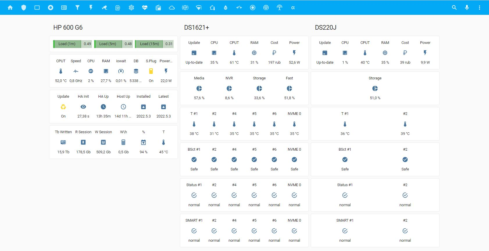
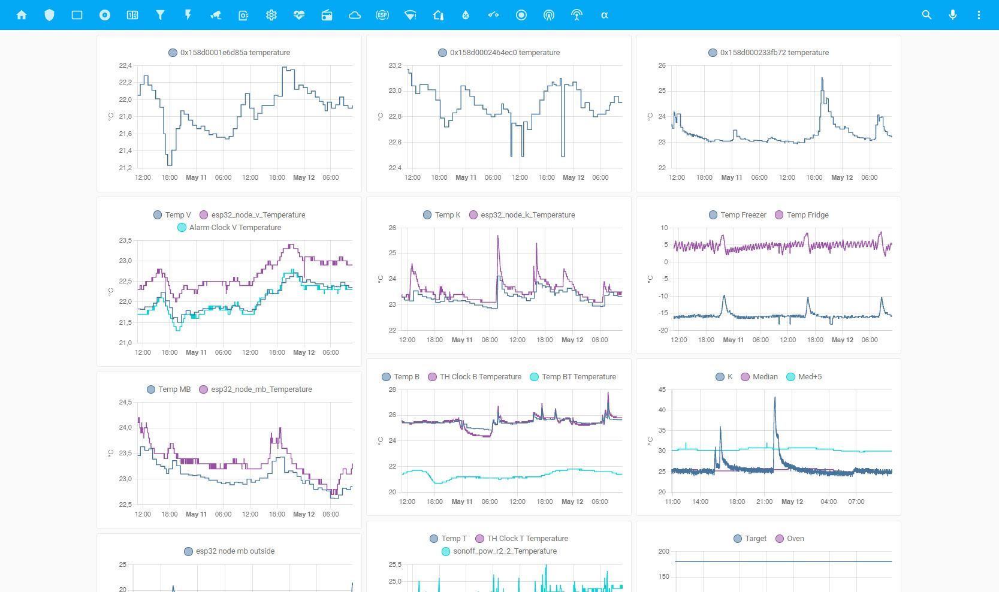
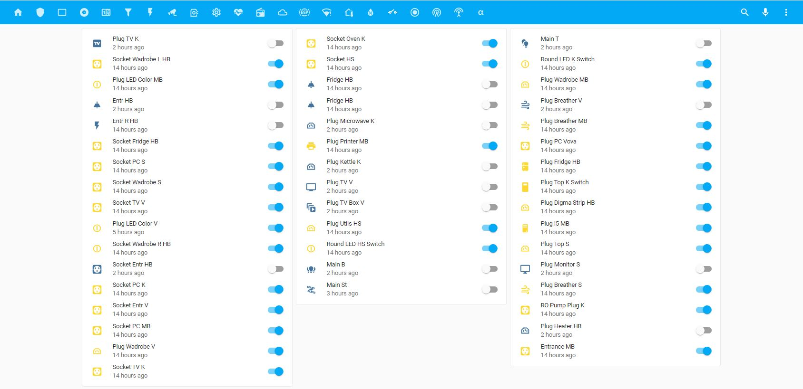

<h1 align="center">
  My Smart Home Configuration
</h1>

  <h4>
    <a href="https://github.com/to4ko/myconfig#hardware-configuration">
      Hardware Configuration
    </a>
     | 
    <a href="https://github.com/to4ko/myconfig#hardware-evolution">
      Hardware Evolution
    </a>
     | 
    <a href="https://github.com/to4ko/myconfig#smart-devices">
      Smart Devices
    </a>
     | 
    <a href="https://github.com/to4ko/myconfig#networking">
      Networking
    </a>
     | 
    <a href="https://github.com/to4ko/myconfig#surveillance">
      Surveillance
    </a>
     | 
    <a href="https://github.com/to4ko/myconfig#screenshots">
      Screenshots
    </a>
     | 
    <a href="https://github.com/to4ko/myconfig#links">
      Links
    </a>
     | 
    <a href="https://github.com/to4ko/myconfig#chats">
      Chats
    </a>
  </h4>

# Hardware Configuration
**Main Unit - HP Prodesk 600 G6 Mini** 
  - Intel i5-10600
  - 2*8Gb Samsung DDR4 SODIMM
  - 512Gb ADATA SX8200 Pro 512Gb NVME
  - Buro BU-BT40C
  - Google Coral m.2

**Main Storage Unit - Synology DS1621+** 
  - 2*16Gb Micron DDR4 SODIMM
  - 8TB WD White as Media Storage
  - 2ea WD RED 2Tb (Storage section for critital files) in SHR1
  - 256Gb Adata SX6000 Lite as NVME read cache

**Backup Storage Unit - Synology DS220J** 
  - 2ea WD RED 2Tb (Storage section for critital files) in SHR1

**Remote Storage Unit - Synology DS215J** 
  - 2ea WD RED 2Tb (Storage section for critital files) in SHR1

**UPS**
  - Ippon Smart Power Pro 1200
  - Ippon Back Basic 1050
  - Ippon Back Basic 650
  - CyberPower UT650EG 

# Networking
  - WAN 500mb\s + LTE Backup
  - Unifi Dream Machine Pro
  - Unifi Switch 16-150W
  - Unifi Switch 8-60W (4ea)
  - Unifi Switch Mini
  - Unifi AC-AP-Lite (2ea)
  - Unifi AC AP Pro (3ea)
  - Unifi NanoHD (not in use)
  - Unifi AP AC Mesh with UMA-D

# Surveillance
  - Unifi Protect on Unifi Dream Machine Pro with 3Tb WD Purple
  - Ubiquiti G3 Flex Cameras (6ea)
  - Digma 100
  - Aliexpress Pinhole camera via iSpyAgent DVR (Docker on DS1621+)

# Smart Devices
**Lights**
  - Yeelight LED Ceiling Lamp650 (YLXD02YL) (2ea)
  - Yeelight LED Ceiling Lamp Pro White 960mm (YLXD08YL)
  - Yeelight LED Ceiling Light Pro 940mm White (YLXD56YL) 
  - Yeelight LED Ceiling Lamp 480mm White (YLXD05YL)
  - Yeelight LED Light Strip (YLDD01YL)
  - Yeelight LED Light Strip Plus (YLDD04YL)
  - Yeelight LED Light Strip 1S (YLDD05YL) (3ea)
  - Yeelight LED Bulb (Color) (YLDP06YL) (2ea)
  - Yeelight LED Tunable Bulb (White) (YLDP05YL) (2ea)
  - Yeelight LED Bedside Lamp 2
  - Xiaomi Philips Zhirui Downlight (9290012799)
  - not in use - Yeelight Jiaoyue 260 (YLXD62YI)
  - not in use - Xiaomi Philips Smart LED Bulb E27 White (9290012800) (2ea)

**Xiaomi\Aqara WiFi Devices:**
  - Xiaomi Gateway v3 (6ea)
  - Xiaomi Air Purifier 2s
  - Xiaomi Wifi Plugs v2 (4ea)
  - not in use - Xiaomi Wifi Plugs v2 (3ea)
  - not in use - Xiaomi IR controller
  - not in use - Qingping Air Monitor Lite (2ea)
  - not in use - Xiaomi Smart WiFi Power Strip (2ea)

**Xiaomi\Aqara Zigbee Devices:**
  - Aqara Wall Socket (21ea)
  - Aqara Wall Switch Double (4ea)
  - Aqara D1 Wall Switch Tripple (1ea)
  - Aqara Wall Switch Single (1ea)
  - Aqara Wireless Switch Double (6ea)
  - Aqara\Xiaomi Door Sensor (25ea)
  - Aqara Water Leak Sensor (4ea)
  - Aqara Vibration Sensor (3ea)
  - Aqara\Xiaomi Motion Sensor (17ea)
  - Aqara\Xiaomi Wireless Button (9ea)
  - Aqara\Xiaomi Temp\Himidity sensor (12ea)
  - Aqara Zigbee Relay (1ea)
  - Aqara Opple Wireless Switch (2ea)
  - Xiaomi Plug (26ea)
  - Xiaomi Smoke Detector (1ea)
  - Xiaomi Natural Gas Detector (1ea)
  - Xiaomi Light Sensor (2ea)
  - not in use - Aqara Opple Wireless Switch (4ea)

**ESPHome flashed devices:**
  - Sonoff Basic (2ea)
  - Sonoff Pow R2 (2ea)
  - Sonoff Mini (3ea)
  - Sonoff 4ch
  - not in use - Sonoff L1
  - not in use - Sonoff S26 Plugs (3ea)
  - not in use - Sonoff Micro via (self powering down)
  - Blitzwolf SHP2 (10ea) and SHP6 (4ea)
  - Blitzwolf LT11
  - not in use - Blitzwolf SS5 dual gang relay
  - Digma IR Remote (3ea)

**ESPHome DIY devices:**
  - ESP32 - Node K - Kitchen SensAir S8, BME280, BHI1750, Water Filter Counters, IR controller
  - ESP32 - Node B - Bathroom Relays (Water valves, Exhaust Fans), Night LED Strip, Dallas sensors on water pipes (Hot and Cold)
  - ESP32 - Node MB - Master Bedroom SensAir S8B, BME280, BHI1750, Dallas sensors (Heating pipe and Outside)
  - ESP32 - Node V - Vova Room SensAir S8, BME280, BHI1750, Dallas sensor (Heating pipe)
  - ESP32 - Hood K - Kitchen Hood Fan\Light Control, BME280, Dallas and max6675 
  - ESP32 - BLE Tracker HB
  - ESP32 - BLE Tracker HS
  - ESP32 - M5 Stack Pico BLE Tracker S
  - ESP32 - M5 Stack Pico BLE Tracker MB
  - ESP32 - Hall Big Breaker Box PZEM-004T
  - ESP8266 Oven K - Kitchen Oven K-type Thermocouple via max6675
  - ESP01 Weight Cell for RO water filter tank
  - D1 Mini LED Bed light
  - D1 Mini S - Sasha Room SensAir S8, BME280, BHI1750, WS2812 LES Strip, HA API Watchdog
  - D1 Mini Air Freshener with Figaro air sensor
  - D1 Mini TOF Distance Sensor
  - BTF Adressable LED strip Controller (based on esp8265) flashed with ESPHome
  - not in use - ESP01 (deepsleep on 14500 LiOn batteries) air freshener (Deerma Aerosol Dispenser DEM-PX830)

**BT\BLE Devices:**
  - CGD1 Cleargrass alarm clock
  - LYWSD02 Temperature and Humidity sensor
  - LYWSD03MMC Hygro thermometer
  - MCCGQ02HL Mijia Window/Door Sensor 2
  - MJYD02YL Motion Activated Night Light
  - Mi Body Composition Scale 2
  - MMC-T201-1 Digital Baby Thermometer
  - YLAI003 Smart Wireless Switch

**Smart Speakers:**
  - not in use - Google Home Mini (6ea)
  - Yandex Station Lite (4ea)
  - Yandex Station Mini 2 (1ea)

**Other Devices:**
  - Digma z801 Tablet
  - SLS Gateway
  - DIYRuZ_Geiger Sensor
  - Shelly EM
  - Shelly 1PM (2ea)
  - Shelly Plug S (3ea)
  - Xiaomi Kettle

# Software configuration
**Main Unit Software:**
  - Debian 11 (backports)
  - Home Assistant Core Supervised
  - PostgreSQL
  - Add-On's: 
    * File Editor
    * ESPhome
    * Grafana
    * Hass.io Google Drive Backup
    * IDE
    * Log Viewer
    * Portainer
    * RPC shutdown

**Main Storage Unit Software**
  - DSM 7.0
  - HA OS instance in VM
  - Docker containers:
    * iSpycam Agent
    * InfluxDB

<!-- **Scripts:**
  - **ipmi_mqtt.sh**  Publishing IPMI, Temp and other system monitoring info to MQTT broker
  - **ha_log_parser.sh**  Backing up HA log to my home directory and splitting it to Error, Warning, Info message type as well as keeping full log. Logs rotated every 5 days.
  - **ya_weather.sh**  Yandex weather fcst ( thanks to [Ivan](https://t.me/configit)  )
  - **root_dev.sh**  Host root device name for monitoring.
  - **gitignore.sh**  bash script to be used after gitigrone file updated
  - **gitupdate.sh**  git upload -->

# Links
  - [Alexxit](https://github.com/alexxit)
  - [Omh](https://github.com/omhy)
  - [Vasilchuk](https://github.com/Anonym-tsk)
  - [S_p_i_r_i_t_u_s](https://github.com/Spirituss)
  - [lapatoc](https://github.com/bastshoes)
  - [Vtel](https://github.com/zvldz)
  - [Enzokot](https://github.com/Enzokot)
  - [AVBor](https://github.com/avbor)
  - [Andrew](https://github.com/andrewjswan)
  - [psmqtt](https://github.com/eschava/psmqtt)

# Chats
  - [Home Assistant RU](https://t.me/homassistant)
  - [Home Assistant - Hardware](https://t.me/homeassistant_hardware)
  - [ESPhome RU](https://t.me/esphome)

# Hardware Evolution

# Screenshots

Few lovelace views

