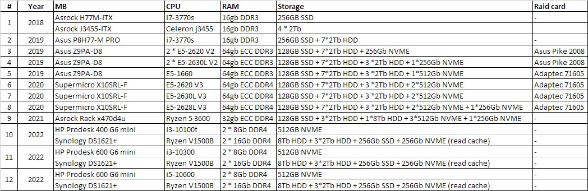
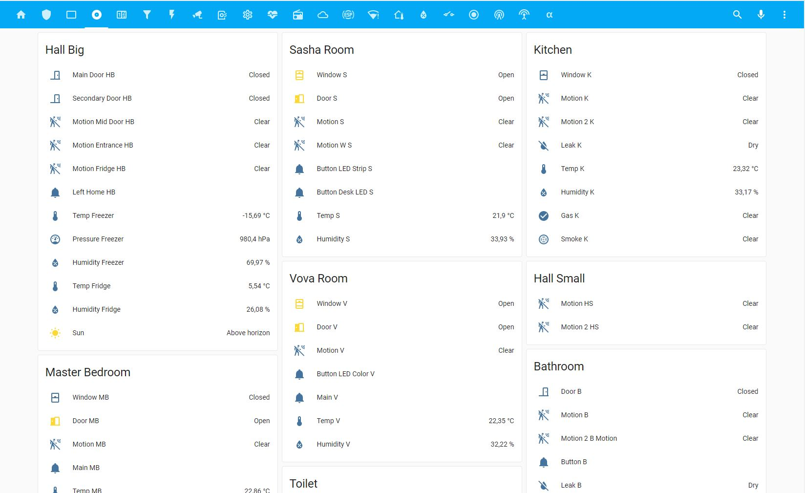
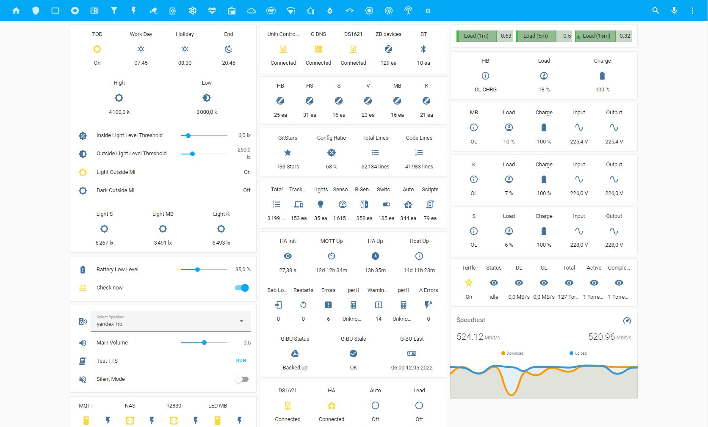
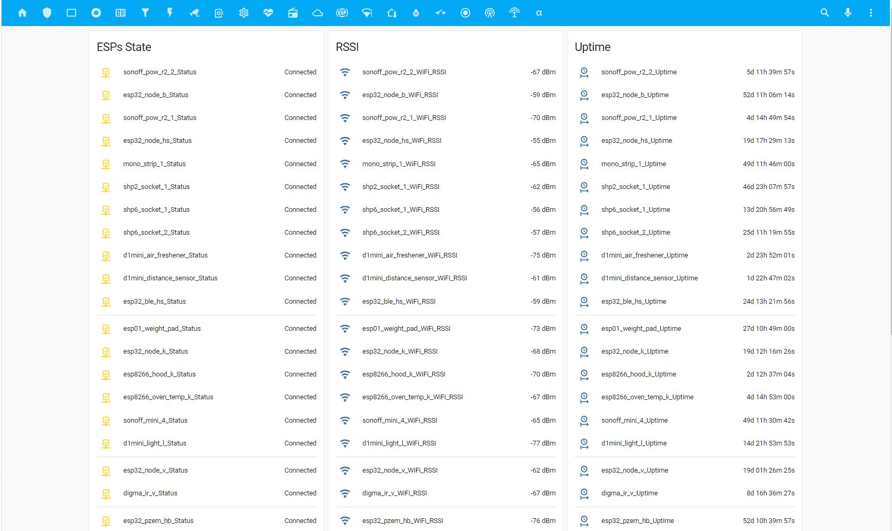
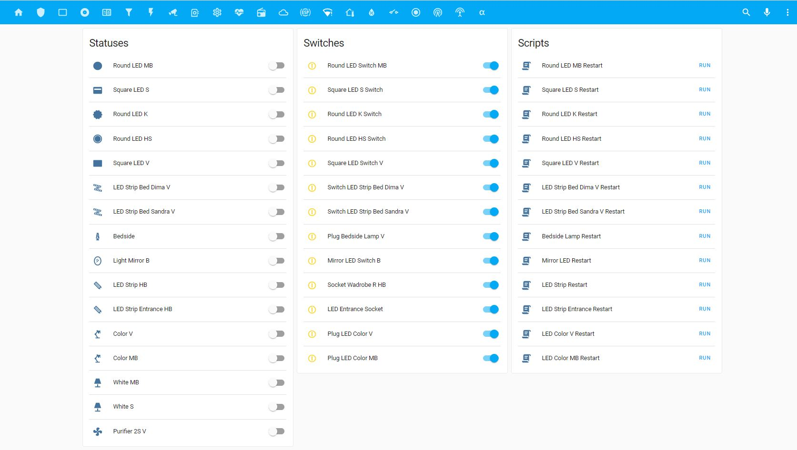
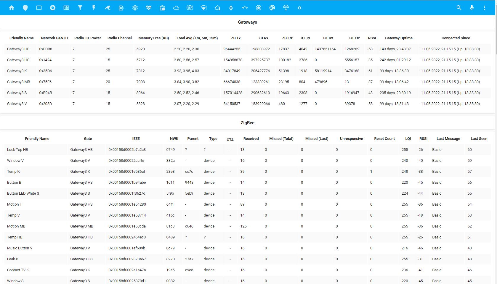
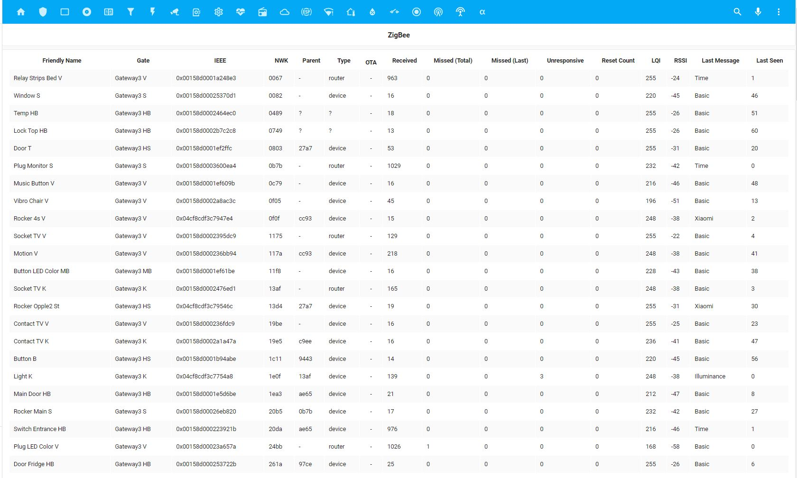

<h1 align="center"><a name="top"></a>
  <a name="logo"></a>
  <br>
  My Smart Home Configuration
</h1>

<div align="center"><a name="menu"></a>
  <h4>
    <a href="https://github.com/to4ko/myconfig#hardware-configuration">
      Hardware Configuration
    </a>
    <span> | </span>
    <a href="https://github.com/to4ko/myconfig#hardware-evolution">
      Hardware Evolution
    </a>
    <span> | </span>
    <a href="https://github.com/to4ko/myconfig#smart-devices">
      Smart Devices
    </a>
    <span> | </span>
    <a href="https://github.com/to4ko/myconfig#networking">
      Networking
    </a>
    <span> | </span>
    <a href="https://github.com/to4ko/myconfig#surveillance">
      Surveillance
    </a>
    <span> | </span>
    <a href="https://github.com/to4ko/myconfig#screenshots">
      Screenshots
    </a>
    <span> | </span>
    <a href="https://github.com/to4ko/myconfig#links">
      Links
    </a>
    <span> | </span>
    <a href="https://github.com/to4ko/myconfig#small-tips">
      Small tips
    </a>
    <span> | </span>
    <a href="https://github.com/to4ko/myconfig#chats">
      Chats
    </a>
  </h4>
</div>

# Hardware Configuration
**Main Unit - HP Prodesk 600 G6 Mini**
  - Intel i5-10600
  - 2*8Gb Samsung DDR4 SODIMM
  - 512Gb ADATA SX8200 Pro 512Gb NVME
  - Buro BU-BT40C
  - Google Coral m.2

**Main Storage Unit - Synology DS1621+** 
  - 2*16Gb Crucial DDR4 SODIMM
  - 16TB WD HC550 as Media Storage
  - 2ea WD Purple 4Tb in SHR1 as Main Storage section
  - 2ea Adata SX6000 Lite 512Gb as NVME read\write cache
  - 2ea Samsung 870 Evo 2Tb in SHR1 as Fast Storage for Docker\VMM

**Plex Unit - Intel Nuc 12 Pro** 
  - 2*8Gb Crucial DDR4 SODIMM
  - Samsung PM9A1 1Tb

**Backup Storage Unit - Synology DS920+**
  - 16Gb Kingston DDR4 SODIMM
  - 2ea WD Purple 4Tb in SHR1 as Main Storage section 
  - 2ea Samsung 860 EVO 500Gb in SHR1
  - 2ea Adata SX6000 Lite 256Gb as NVME read\write cache

**Remote Storage Unit - Synology DS220+** 
  - 2ea Seagate Skyhawk 4Tb in SHR1 as Main Storage section
  - Upcoming remote HA server

**UPS**
  - Ippon Back Basic 1500
  - Ippon Smart Power Pro 1200
  - Ippon Back Basic 1050
  - Ippon Back Basic 650
  - CyberPower UT650EG 

# Networking
  - Ufiber Loco
  - Unifi Dream Machine Pro, WAN1 1Gb\s + WAN2 500Mb\s + LTE Backup
  - Unifi Enterprise Switch 24 PoE
  - Unifi Switch Light 8 PoE (3ea)
  - Unifi Switch Flex (2ea)
  - Unifi Switch Flex Mini (2ea)
  - Unifi AC AP Lite (2ea)
  - Unifi U6 Pro (3ea)
  - Unifi AP AC Mesh with UMA-D (yard WiFi)

# Surveillance
  - Unifi Protect on Unifi Dream Machine Pro with 3Tb WD Purple
  - Ubiquiti G3 Flex Cameras (6ea)
  - Digma 100
  - Aliexpress Pinhole camera via Synology Surveillance Station on DS1621+

# Smart Devices
**Lights**
  - Yeelight LED Ceiling Lamp650 (YLXD02YL) (2ea)
  - Yeelight LED Ceiling Lamp Pro White 960mm (YLXD08YL)
  - Yeelight LED Ceiling Light Pro 940mm White (YLXD56YL) 
  - Yeelight LED Ceiling Lamp 480mm White (YLXD05YL)
  - Yeelight LED Light Strip (YLDD01YL)
  - Yeelight LED Light Strip Plus (YLDD04YL)
  - Yeelight LED Light Strip 1S (YLDD05YL) (3ea)
  - Yeelight LED Bulb (Color) (YLDP06YL) (2ea)
  - Yeelight Smart LED Bubl W3 (YLDP005) (1ea)
  - Yeelight LED Tunable Bulb (White) (YLDP05YL) (2ea)
  - Yeelight Display Light Lamp Pro (YLTD003) (1ea)
  - Xiaomi Philips Zhirui Downlight (9290012799) (1ea)
  - not in use - Yeelight Jiaoyue 260 (YLXD62YI)
  - not in use - Xiaomi Philips Smart LED Bulb E27 White (9290012800) (2ea)

**Xiaomi\Aqara WiFi Devices:**
  - Xiaomi Multimode Gateway 2 CN (6ea)
  - Xiaomi Air Purifier 2s
  - Xiaomi Wifi Plugs v2 (4ea)
  - not in use - Xiaomi Wifi Plugs v2 (3ea)
  - not in use - Xiaomi IR controller
  - not in use - Qingping Air Monitor Lite (2ea)
  - not in use - Xiaomi Smart WiFi Power Strip (2ea)

**Xiaomi\Aqara Zigbee Devices:**
  - Aqara Vibration sensor DJT11LM (4ea)
  - Xiaomi Light Detection Sensor GZCGQ01LM (4ea)
  - Xiaomi Honeywell Natural Gas Sensor JTQJ-BF-01LM/BW (1ea)
  - Xiaomi Honeywell Smoke JTYJ-GD-01LM/BW (1ea)
  - Aqara Relay LLKZMK11LM (1ea)
  - Xiaomi Door Sensor MCCGQ01LM (15ea)
  - Aqara Door Sensor MCCGQ11LM (11ea)
  - Aqara Wall Outlet QBCZ11LM (14ea)
  - Aqara Wall Switch (No Neutral, Double Rocker) QBKG03LM (4ea)
  - Aqara E1 Wall Switch (With Neutral, Double Rocker) QBKG41LM (1ea)
  - Xiaomi Motion Sensor RTCGQ01LM (4ea)
  - Aqara Motion Sensor RTCGQ11LM (13ea)
  - Aqara Water Leak Sensor SJCGQ11LM (4ea)
  - Xiaomi Temperature Humidity sensor WSDCGQ01LM (8ea)
  - Aqara Temperature Humidity Pressure Sensor WSDCGQ11LM (4ea)
  - Aqara Opple Wireless Scene Switch 2 Button WXCJKG11LM (2ea)
  - Aqara Opple Wireless Scene Switch 4 Button WXCJKG12LM (1ea)
  - Xiaomi Mijia Wireless Switch WXKG01LM (2ea)
  - Aqara Wireless Remote Switch (Double Rocker) (2016 version) WXKG02LM (3ea)
  - Aqara Wireless Mini Switch WXKG11LM (2ea)
  - Aqara Wireless Mini Switch with Gyroscope WXKG12LM (2ea)
  - Aqara E1 Wireless Remote Switch (Double Rocker) WXKG17LM (1ea)
  - Xiaomi Mi Power Plug ZigBee ZNCZ02LM (24ea)

**Xiaomi BT\BLE Devices:**
  - CGD1 Cleargrass alarm clock
  - LYWSD02 Temperature and Humidity sensor
  - LYWSD03MMC Hygro thermometer
  - MCCGQ02HL Mijia Window/Door Sensor 2
  - MJYD02YL Motion Activated Night Light
  - Mi Body Composition Scale 2
  - MMC-T201-1 Digital Baby Thermometer
  - YLAI003 Smart Wireless Switch
  - HB01 Linptech ES1 Presence Sensor
  - RTCGQ02LM Mi Motion Sensor 2
  - CGPR1 Qingping Motion Sensor

**ESPHome devices:**
  - Sonoff Pow R2 (2ea)
  - Sonoff Mini (3ea)
  - not in use - Sonoff 4ch
  - not in use - Sonoff L1
  - not in use - Sonoff S26 Plugs (3ea)
  - not in use - Sonoff Micro via (self powering down)
  - not in use - Blitzwolf SHP2 (10ea) and SHP6 (4ea)
  - Blitzwolf LT11
  - not in use - Blitzwolf SS5 dual gang relay
  - Digma IR Remote (4ea)

**ESPHome DIY devices:**
  - ESP32 - Node K - Kitchen SensAir S8, BME280, BHI1750, Water Filter Counters, IR controller
  - ESP32 - Node B - Bathroom Relays (Water valves, Exhaust Fans), Night LED Strip, Dallas sensors on water pipes (Hot and Cold)
  - ESP32 - Node MB - Master Bedroom SensAir S8B, BME280, BHI1750, Dallas sensors (Heating pipe and Outside)
  - ESP32 - Node V - Vova Room SensAir S8, BME280, BHI1750, Dallas sensor (Heating pipe)
  - ESP32 - Node S - Sasha Room SensAir S8, BME280, BHI1750, WS2812 LES Strip, HA API Watchdog
  - ESP32 - Hood K - Kitchen Hood Fan\Light Control, BME280, Dallas and max6675
  - ESP32 - Node HS - Hall Small adressable LED controller with BME280 and ClimateGuard Geiger sensor 
  - ESP32 - BLE Gateway HB
  - ESP32 - GL.iNET GL-S10 POE powered BLE Gateway (3ea)
  - ESP32 - Hall Big Breaker Box PZEM-004T
  - ESP8266 Oven K - Kitchen Oven K-type Thermocouple via max6675
  - ESP01 Weight Cell for RO water filter tank
  - not in use - D1 Mini LED Bed light
  - D1 Mini Air Freshener with Figaro air sensor
  - D1 Mini TOF Distance and LD2410 Radar
  - BTF Adressable LED strip Controller (based on esp8265) flashed with ESPHome
  - not in use - ESP01 (deepsleep on 14500 LiOn batteries) air freshener (Deerma Aerosol Dispenser DEM-PX830)

**Smart Speakers:**
  - not in use - Google Home Mini (5ea)
  - Yandex Station Lite (4ea)
  - Yandex Station Mini 2 (1ea)

**Other Devices:**
  - Digma z801 Tablet
  - not in use - SLS Gateway
  - not in use - DIYRuZ_Geiger Sensor
  - Shelly EM
  - Shelly 1PM (2ea)
  - Shelly 1 (2ea)
  - Shelly Plug S (2ea)
  - not in use - Xiaomi Kettle

# Software configuration
**Main Unit Software:**
  - Debian 11
  - Home Assistant Core Supervised
  - PostgreSQL
  - Add-On's: 
    * File Editor
    * ESPhome
    * Grafana
    * Home Assistant Google Drive Backup
    * IDE
    * Log Viewer
    * Portainer
    * RPC shutdown
    * Visual Studio Code

**Main Storage Unit Software**
  - DSM 7.2
  - HA OS instance in VM
  - Docker containers:
    * Mosquitto
    * InfluxDB
    * Transmission

<!-- **Scripts:**
  - **ipmi_mqtt.sh**  Publishing IPMI, Temp and other system monitoring info to MQTT broker
  - **ha_log_parser.sh**  Backing up HA log to my home directory and splitting it to Error, Warning, Info message type as well as keeping full log. Logs rotated every 5 days.
  - **ya_weather.sh**  Yandex weather fcst ( thanks to [Ivan](https://t.me/configit)  )
  - **root_dev.sh**  Host root device name for monitoring.
  - **gitignore.sh**  bash script to be used after gitigrone file updated
  - **gitupdate.sh**  git upload -->

# Links
  - [Alexxit](https://github.com/alexxit)
  - [Omh](https://github.com/omhy)
  - [Vasilchuk](https://github.com/Anonym-tsk)
  - [S_p_i_r_i_t_u_s](https://github.com/Spirituss)
  - [lapatoc](https://github.com/bastshoes)
  - [Vtel](https://github.com/zvldz)
  - [Enzokot](https://github.com/Enzokot)
  - [AVBor](https://github.com/avbor)
  - [Andrew](https://github.com/andrewjswan)

# Chats
  - [Home Assistant RU](https://t.me/homassistant)
  - [Home Assistant - Hardware](https://t.me/homeassistant_hardware)
  - [ESPhome RU](https://t.me/esphome)

# Small Tips
<details>
  <summary>List of integrations in use</summary>

  ```yaml
  
  
  
    
    
      
      
        
      
    
  
  {{ ns.integrations }}
  ```
</details>

<details>
  <summary>some usefull SQL tips</summary>

  ```
  SELECT m.entity_id, COUNT(*) as count FROM states as s JOIN states_meta AS m ON s.metadata_id = m.metadata_id GROUP BY m.metadata_id ORDER BY count DESC LIMIT 100;
  ```
  ```
  SELECT SUM(pgsize) bytes, name FROM dbstat GROUP BY name ORDER BY bytes DESC;
  ```
  ```
  SELECT m.statistic_id, COUNT(*) as count FROM statistics as s JOIN statistics_meta AS m ON s.metadata_id = m.id GROUP BY m.statistic_id ORDER BY count DESC LIMIT 100;
  ```
  ```
  DELETE FROM states WHERE metadata_id IN (SELECT metadata_id FROM states_meta WHERE entity_id = 'sensor.your_sensor');
  ```
</details>

<details>
  <summary>List of all used domains</summary>

  ```yaml
  
    {{ d[0] }}
  
  ```
</details>

<details>
  <summary>List of all devices(IDs) per integration</summary>

  ```yaml
  {{ integration_entities('yeelight') |  map('device_id') | unique | list }}
  ```
</details>

# Hardware Evolution
<!--  -->
<details><summary>Click me...</summary>
<table max-width:100%;
white-space:nowrap;>
<tbody>
<tr>
<td>#</td>
<td>Year</td>
<td>Motherboard</td>
<td>CPU</td>
<td>RAM</td>
<td>Storage</td>
<td>Raid card</td>
</tr>
<tr>
<td rowspan="2">1</td>
<td rowspan="2">2018</td>
<td>Asrock H77M-ITX</td>
<td>i7-3770s</td>
<td>16gb DDR3</td>
<td>256GB SSD</td>
<td>-</td>
</tr>
<tr>
<td>Asrock J3455-ITX</td>
<td>Celeron j3455</td>
<td>16gb DDR3</td>
<td>4 * 2Tb HDD</td>
<td>&nbsp;</td>
</tr>
<tr>
<td>2</td>
<td>2019</td>
<td>Asus P8H77-M PRO</td>
<td>i7-3770s</td>
<td>16gb DDR3</td>
<td>256GB SSD + 7*2Tb HDD</td>
<td>-</td>
</tr>
<tr>
<td>3</td>
<td>2019</td>
<td>Asus Z9PA-D8</td>
<td>2 * E5-2620 V2</td>
<td>64gb ECC DDR3</td>
<td>128GB SSD + 7*2Tb HDD + 256Gb NVME</td>
<td>Asus Pike 2008</td>
</tr>
<tr>
<td>4</td>
<td>2019</td>
<td>Asus Z9PA-D8</td>
<td>2 * E5-2630L V2</td>
<td>64gb ECC DDR3</td>
<td>128GB SSD + 7*2Tb HDD + 3 *2Tb HDD + 1*256Gb NVME</td>
<td>Asus Pike 2008</td>
</tr>
<tr>
<td>5</td>
<td>2019</td>
<td>Asus Z9PA-D8</td>
<td>E5-1660</td>
<td>64gb ECC DDR3</td>
<td>128GB SSD + 7*2Tb HDD + 3 *2Tb HDD + 1*512Gb NVME</td>
<td>Adaptec 71605</td>
</tr>
<tr>
<td>6</td>
<td>2020</td>
<td>Supermicro X10SRL-F</td>
<td>E5-2620 V3</td>
<td>64gb ECC DDR4</td>
<td>128GB SSD + 7*2Tb HDD + 3 *2Tb HDD + 2*512Gb NVME</td>
<td>Adaptec 71605</td>
</tr>
<tr>
<td>7</td>
<td>2020</td>
<td>Supermicro X10SRL-F</td>
<td>E5-2630L V3</td>
<td>64gb ECC DDR4</td>
<td>128GB SSD + 7*2Tb HDD + 3 *2Tb HDD + 2*512Gb NVME</td>
<td>Adaptec 71605</td>
</tr>
<tr>
<td>8</td>
<td>2020</td>
<td>Supermicro X10SRL-F</td>
<td>E5-2628L V3</td>
<td>64gb ECC DDR4</td>
<td>128GB SSD + 7*2Tb HDD + 3 *2Tb HDD + 2*512Gb NVME + 1*256Gb NVME</td>
<td>Adaptec 71605</td>
</tr>
<tr>
<td>9</td>
<td>2021</td>
<td>Asrock Rack x470d4u</td>
<td>Ryzen 5 3600</td>
<td>32gb ECC DDR4</td>
<td>128GB SSD + 3*2Tb HDD + 1*8Tb HDD + 3*512Gb NVME + 1*256Gb NVME</td>
<td>-</td>
</tr>
<tr>
<td rowspan="2">10</td>
<td rowspan="2">2022</td>
<td>HP Prodesk 400 G6 mini</td>
<td>i3-10100t</td>
<td>2 * 8Gb DDR4</td>
<td>512GB NVME</td>
<td>-</td>
</tr>
<tr>
<td>Synology DS1621+</td>
<td>Ryzen V1500B</td>
<td>2 * 16Gb DDR4</td>
<td>8Tb HDD + 3*2Tb HDD + 256Gb SSD + 256Gb NVME (read cache)</td>
<td>-</td>
</tr>
<tr>
<td rowspan="2">11</td>
<td rowspan="2">2022</td>
<td>HP Prodesk 600 G6 mini</td>
<td>i3-10100</td>
<td>2 * 8Gb DDR4</td>
<td>512GB NVME</td>
<td>-</td>
</tr>
<tr>
<td>Synology DS1621+</td>
<td>Ryzen V1500B</td>
<td>2 * 16Gb DDR4</td>
<td>8Tb HDD + 3*2Tb HDD + 256Gb SSD + 256Gb NVME (read cache)</td>
<td>-</td>
</tr>
<tr>
<td rowspan="2">12</td>
<td rowspan="2">2022</td>
<td>HP Prodesk 600 G6 mini</td>
<td>i5-10600</td>
<td>2 * 8Gb DDR4</td>
<td>512GB NVME</td>
<td>-</td>
</tr>
<tr>
<td>Synology DS1621+</td>
<td>Ryzen V1500B</td>
<td>2 * 16Gb DDR4</td>
<td>8Tb HDD + 3*2Tb HDD + 256Gb SSD + 256Gb NVME (read cache)</td>
<td>-</td>
</tr>
<tr>
<td rowspan="2">13</td>
<td rowspan="2">2022</td>
<td>HP Prodesk 600 G6 mini</td>
<td>i5-10600</td>
<td>2 * 8Gb DDR4</td>
<td>512GB NVME</td>
<td>-</td>
</tr>
<tr>
<td>Synology DS1621+</td>
<td>Ryzen V1500B</td>
<td>2 * 16Gb DDR4</td>
<td>16Tb HDD + 2*4Tb HDD + 2*2Tb SSD + 2*512Gb NVME (read\write cache)</td>
<td>-</td>
</tr>
<tr>
<td rowspan="3">14</td>
<td rowspan="3">2023</td>
<td>HP Prodesk 600 G6 mini</td>
<td>i5-10600</td>
<td>2 * 8Gb DDR4</td>
<td>512GB NVME</td>
<td>-</td>
</tr>
<tr>
<td>Synology DS1621+</td>
<td>Ryzen V1500B</td>
<td>2 * 16Gb DDR4</td>
<td>16Tb HDD + 2*4Tb HDD + 2*2Tb SSD + 2*512Gb NVME (read\write cache)</td>
<td>-</td>
</tr>
<tr>
<td>Intel Nuc 12 Pro</td>
<td>i3-1220p</td>
<td>2 * 8Gb DDR4</td>
<td>1Tb NVME</td>
<td>-</td>
</tr>

</tbody>
</table>
</details>

# Screenshots
<details><summary>Click me...</summary>















</details>